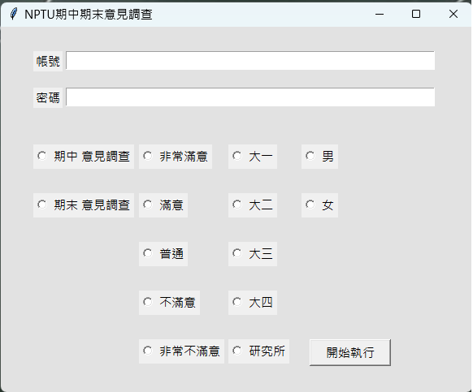

https://github.com/ScaryMoon/sideproject_NPTUsurvey/assets/93481378/ffd58f14-2798-4ac4-9725-53977ee3f757

#使用注意
> 先看自己googleChorme的版本(右邊三個點->設定->關於Chrome)找到版本111.0.5XXXX(只要看前面5位數字就行)  
> 找到相對應的版本https://chromedriver.chromium.org/downloads  
> 下載後解壓縮(取代掉此資料夾的chromedriver.exe  
> 放到此檔案資料夾裡即可執行程式  
